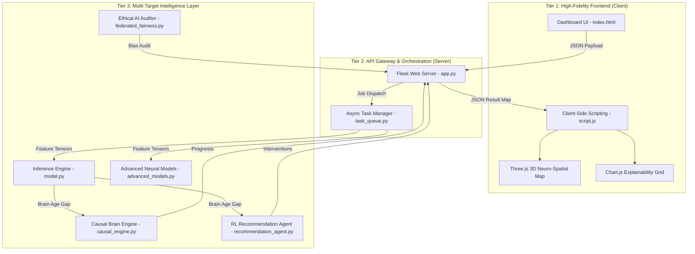

# 🏗️ NeuroAge: Architecture, Design, and Workflow Master Blueprint

> **A deep-dive into the structural engineering, mathematical design patterns, and synchronous/asynchronous workflows that power the NeuroAge Research Suite.**

---

## 1. High-Level System Architecture

NeuroAge is built upon a **Decoupled Client-Server Architecture** designed for high-performance neuro-computational tasks. It separates heavy inference and explainability (XAI) permutations from the user interface to ensure a "zero-lag" clinical experience.

### 🧩 3-Tier Structural Map

---

## 2. Technical Design Patterns

### 2.1. Asynchronous Job Design (The Task Queue)
Because generating **17 Deep Model predictions** and **SHAP/LIME importance maps** can take up to 3-5 seconds, NeuroAge avoids blocking the main HTTP process.
- **Design**: Uses a custom `TaskManager` class with `threading`. 
- **Pattern**: The API returns a `task_id` immediately. The frontend "polls" for status.
- **Benefit**: This prevents "Request Timeout" errors and allows for a real-time progress bar (0% to 100%) in the UI.

### 2.2. Mathematical Explainability Alignment
A unique design pattern used in the project to synchronize the different mathematical languages of **SHAP** and **LIME**.
- **The Problem**: LIME uses local linear slopes; SHAP uses global marginal contributions. They often have different scales.
- **The Solution**: An algebraic normalization layer forces LIME's coefficients to exist on the same diagnostic vector space as SHAP.
- **Result**: Visual consistency where a bar to the right (Red) always means "Accelerated Aging" across all frameworks.

### 2.3. Causal "Do-Calculus" Design (`causal_engine.py`)
Moving beyond correlation, the engine is designed around Judea Pearl's **Structural Causal Models (SCM)**.
- **Structural Constraints**: The design enforces that `Sleep` influences `Alpha Power`, which in turn influences `Brain Age`. 
- **Intervention Layer**: By using the `do()` operator, the system forces a specific lifestyle variable to a target value, allowing it to calculate the **Average Treatment Effect (ATE)** without the noise of confounding variables.

---

## 3. The 9-Step Patient Workflow

The workflow represents the journey of a single EEG dataset through the NeuroAge pipeline.

| Step | Action | Description |
| :-- | :-- | :-- |
| **1. Ingestion** | Data Input | Clinician enters 25 spectral power features or loads a subjects. |
| **2. Dispatch** | Async Enqueue | `app.py` generates a UUID and hands the job to `task_queue.py`. |
| **3. Normalization** | Robust Scaling | Features are scaled against a normative database of 1000+ subjects. |
| **4. Inference** | Multi-Model Pass | Data passes through GNNs (spatial), Transformers (spectral), and Ensembles. |
| **5. Explanation** | XAI Extraction | SHAP DeepExplainer and LIME perturbations are calculated in parallel. |
| **6. Simulation** | Causal Routing | The `causal_engine` generates a 10-year prognosis trajectory. |
| **7. Optimization** | Agent Policy | The RL Agent selects the top-reward lifestyle interventions (Q-Learning). |
| **8. Synthesis** | API Aggregation | Results are bundled into a cohesive JSON Clinical Intelligence object. |
| **9. Visualization** | Frontend Render | `script.js` activates Three.js (3D Brain) and Chart.js for the final display. |

---

## 4. Component-Level Documentation

### 🛠️ Backend Core
1.  **`app.py`**: The Orchestrator. Manages routes, security, and state.
2.  **`model.py`**: The Brain. Contains the 17 ML/DL algorithms and the uncertainty estimation logic.
3.  **`advanced_models.py`**: The Connectivity Layer. Implements GNNs (Graph Neural Networks) to map how brain regions talk to each other.
4.  **`federated_fairness.py`**: The Ethical Layer. Protects patient privacy via simulated FedAvg and ensures zero demographic bias.

### 🎨 Frontend Logic
1.  **`script.js`**: A 1500-line controller managing state, animations, WebGL rendering, and chart updates.
2.  **Architecture**: Uses a modular function pattern (e.g., `drawSHAPChart`, `updateSpatialHeatmap`, `initTabNavigation`).
3.  **UI Feedback**: Implements a "Real-Time Slider" mechanism that allows for instant fast-predictions (`/api/predict_fast`) before the final Deep Analysis is even triggered.

---

> **Design Goal**: To build a system that feels like a real-time medical instrument—combining extreme technical complexity (Ensembles, Graphs, Causal AI) with a seamless, zero-friction medical interface.
